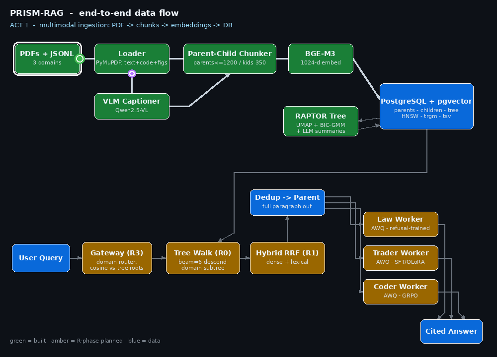
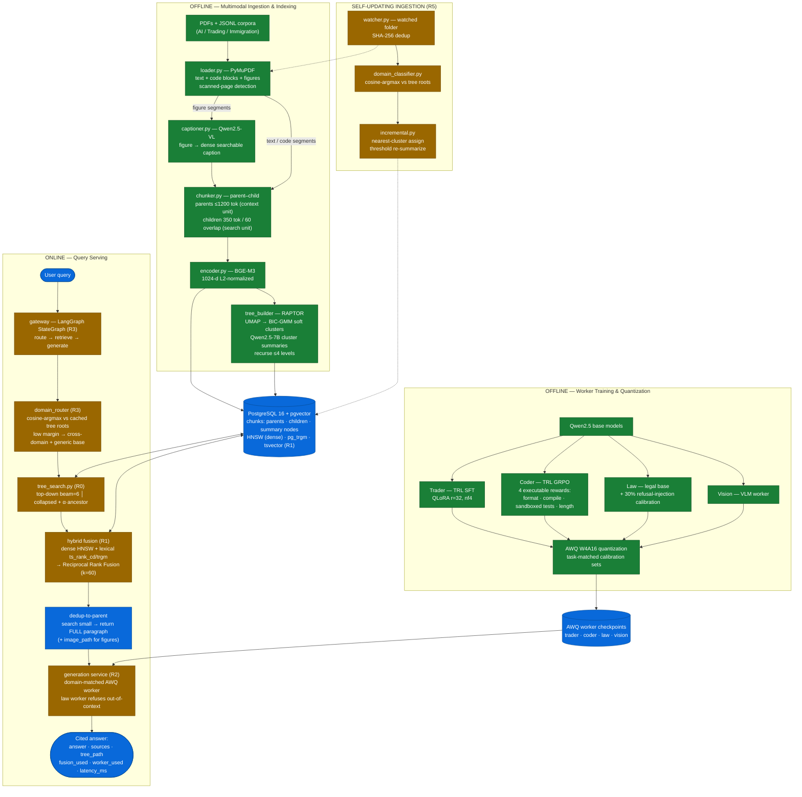

# PRISM-RAG

### Progressive Retrieval with Indexed Summary Memory

         

> **A multimodal, tree-guided RAG system built end-to-end from scratch:**
> PDF ingestion with figure understanding (vision-language captioning),
> RAPTOR-style hierarchical indexing, parent–child retrieval over
> PostgreSQL/pgvector, and three domain-specialist LLMs fine-tuned
> (SFT + GRPO) and quantized (AWQ 4-bit) from a shared Qwen2.5 base —
> all containerized, all in one database, no managed services.

---

## TL;DR — what this project demonstrates

If you're evaluating this repo, here is the skill surface in 30 seconds:

| Skill area | Where it shows up in this repo |
|---|---|
| **Multimodal document AI** | PyMuPDF layout-aware PDF parsing; figures extracted and captioned by Qwen2.5-VL so charts/diagrams become searchable text (`agents/ingestion/loader.py`, `captioner.py`) |
| **Retrieval engineering** | Parent–child (small-to-big) chunking; RAPTOR hierarchical tree (UMAP + BIC-selected Gaussian Mixture soft clustering); HNSW dense ANN + trigram lexical search in plain PostgreSQL (`agents/ingestion/chunker.py`, `agents/tree_builder/`, `init.sql`) |
| **LLM fine-tuning** | TRL SFT with QLoRA (finance domain); TRL **GRPO with four executable reward functions** including sandboxed unit-test execution (coding domain) (`training/`) |
| **Quantization** | AWQ W4A16 pipelines for four workers (trader / coder / law / vision), with task-matched calibration data and refusal-behavior-aware calibration for the legal model (`training/awq_quantize_*.py`) |
| **Systems & MLOps** | FastAPI microservices, Docker, uv-managed deps, content-hash dedup, per-transaction `ef_search` tuning, W&B experiment tracking |
| **Engineering honesty** | The build-status table below says exactly what is done, in progress, and planned — verified against the code, not aspirational |

---

## The problem

Standard RAG fails in compounding ways on heterogeneous, real-world corpora:

1. **Topic contamination.** A query about Korean visa renewal pulls back
   trading documents that share surface vocabulary ("application," "filing,"
   "deadline"). Flat dense search has no notion of subject domain.
2. **Figures are invisible.** Most pipelines throw away charts, tables, and
   diagrams — often the densest information in financial and legal PDFs.
3. **Chunking destroys context.** Fixed-token windows cut sentences in half
   and return fragments too small to answer from.
4. **One generic LLM for everything.** A finance question deserves a model
   trained on finance reasoning; a legal question deserves a model trained to
   **refuse when the answer isn't in context** — something generic
   instruction-tuned models do poorly.

## The PRISM-RAG answer

```
Standard RAG:   split everything into 512-token chunks
                → cosine search over all of them
                → one generic LLM answers (figures ignored)

PRISM-RAG:      PDF → text + code + FIGURES (VLM-captioned, searchable)
                → paragraph-aware parent–child chunks
                → RAPTOR topic tree (soft GMM clusters + LLM summaries)
                → tree-guided retrieval: search small (child shards),
                  return big (full parent paragraphs)
                → route to a domain-specialist AWQ worker
                  (trader / coder / law — law worker trained to refuse
                  on out-of-context questions)
```

Three domains stress-test the design: **AI research papers**,
**financial/trading news + strategy PDFs**, and **Korean immigration law
PDFs** — deliberately heterogeneous in language, structure, and figure
density.

---

## System flowchart



*Animated in three acts. Act 1 — multimodal ingestion: PDF → loader →
VLM-captioned figures → parent–child chunks → embeddings → PostgreSQL.
Act 2 — RAPTOR tree build: cluster → summarize → re-embed. Act 3 — three
worked query examples, one per domain, each annotated stage-by-stage:
an exact-identifier **immigration** question ("F-2-7-7 visa renewal") where
lexical search rescues a code dense retrieval misses, routed to the
refusal-trained **Law worker**; a **trading** question ("AAPL after Q3
earnings") retrieving news paragraphs plus a VLM-captioned price chart,
routed to the SFT **Trader worker**; and a **coding** question against the
AI corpus routed to the GRPO-trained **Coder worker**, which emits
reasoning before code. Non-selected workers dim so the routing decision is
visible at a glance.*

End-to-end data flow — offline pipelines feed one PostgreSQL instance; the
online path reads from it. Green = built and working, amber = in progress /
planned (phase marked).



**Reading the flow:** everything converges on one PostgreSQL instance —
parents, children, RAPTOR summaries, dense vectors, and lexical indexes
live in a single `chunks` table. The online path searches small (child
shards + summaries), fuses dense and lexical rankings, then returns the
full parent paragraph to a domain-matched 4-bit worker. No external vector
DB, no search engine, no managed services.

---

## Three design decisions worth reading

**1. Search small, return big (parent–child retrieval).**
Embeddings are most accurate on focused ~350-token spans, but LLMs answer
best from full paragraphs. So every paragraph is stored once as a *parent*
(up to 1200 tokens, the context unit) and sharded into overlapping *child*
windows (the search units). Retrieval ranks children, then returns their
deduplicated parents. One table, one flag (`is_searchable`), no duplication
of concerns.

**2. Figures are first-class citizens.**
PyMuPDF extracts every figure above a size threshold; Qwen2.5-VL writes a
dense, domain-prompted caption ("chart type, axes, indicators, trend, key
values"). The caption is what gets embedded and searched; the image path
travels with the row so the original figure can be shown alongside the
answer. Scanned pages are detected (big image + near-empty text layer) and
routed to transcription instead of captioning.

**3. Quantization can silently delete safety behavior — calibrate for it.**
The legal worker must say *"the answer is not contained in the provided
context"* rather than hallucinate. Naive 4-bit AWQ calibration on generic
text risks degrading exactly that behavior. The law worker's calibration
set therefore injects ~30% answer-not-in-context refusal examples.
(Whether this fully preserves the FP16 refusal rate is measured in the
Phase R4 ablation — treated as a hypothesis until the numbers are in.)

---

## Build status (verified against code, not aspirational)

| Phase | Component | Status |
|---|---|---|
| 1 | Multimodal ingestion: PDF/JSONL → text + code + VLM-captioned figures → parent–child chunks | ✅ Done |
| 2 | BGE-M3 embeddings + per-domain HNSW indexes | ✅ Done |
| 3 | RAPTOR tree: UMAP + soft GMM (BIC) + Qwen2.5-7B cluster summaries | ✅ Done |
| 5 | Domain workers: trader (SFT/QLoRA), coder (GRPO, executable rewards), law, vision — all AWQ W4A16 | ✅ Done |
| R0 | Retrieval service repair: tree-walk search (top-down beam + collapsed re-rank) behind FastAPI | ⏳ In progress |
| R1 | Hybrid retrieval: tsvector lexical search + Reciprocal Rank Fusion | ⏳ Planned |
| R2 | Generation service: AWQ worker registry + cited answers | ⏳ Planned |
| R3 | LangGraph gateway + full Docker Compose stack | ⏳ Planned |
| R4 | Evaluation: synthetic QA, retrieval matrix ({tree mode} × {fusion}), worker-vs-base ablation | ⏳ Planned |
| R5 | Self-updating ingestion: watched-folder PDFs, hash dedup, incremental tree placement | ⏳ Planned |

Full phase specs, schema, and verification gates: [`ARCHITECTURE.md`](./ARCHITECTURE.md).

---

## Project structure

```
PRISM-RAG/
├── README.md                              ✓ user-facing entry point
├── ARCHITECTURE.md                        ✓ canonical spec, phases, verification gates
├── init.sql                               ✓ chunks/documents schema, HNSW, pg_trgm   (R1 adds tsvector + GIN)
├── docker-compose.yml                     ✓ postgres                                  (R3 adds retrieval/generation/gateway)
├── pyproject.toml / uv.lock               ✓ uv-managed dependencies
├── .env.example                           ✓ PG_DSN, PRISM_DATA_DIR, model paths
├── main.py                                ✓ entry stub
│
├── docs/                                  ✓ README assets
│   ├── prism_dataflow.gif                 ✓ animated end-to-end data-flow (3 acts, 3 worked examples)
│   └── make_dataflow_gif.py               ✓ deterministic GIF generator — edit + rerun when phases flip
│
├── data/                                  JSONL corpus + user PDFs + extracted figures
│   ├── download.py                        ✓ HuggingFace dataset downloader
│   ├── _images/                           ✓ figures extracted from PDFs (PRISM_IMAGE_DIR)
│   ├── ai/                                ml_arxiv_papers.jsonl + research PDFs
│   ├── trading/                           financial_news.jsonl + user_pdfs/   ← R5 watched folder
│   └── immigration/                       user_pdfs/                          ← R5 watched folder
│
├── checkpoints/
│   ├── source_model/
│   │   ├── qwen_2_5/                      ✓ Qwen2.5-7B-Instruct (summarizer + trader/coder base)
│   │   ├── vision_model/                  ✓ Qwen2.5-VL-3B (figure captioner, fp16)
│   │   └── law_llm/                       ✓ law worker base
│   ├── calibration_data/                  ✓ AWQ calibration sets (trader / coder / legal / vision)
│   └── awq_models/                        ✓ shipped W4A16 worker checkpoints
│
├── agents/
│   ├── ingestion/                         ✓ Phases 1–2 (multimodal)
│   │   ├── config.py                      ✓ paths, models, chunk params (fix stale domain map — R0)
│   │   ├── db.py                          ✓ psycopg helpers, insert pipeline
│   │   ├── loader.py                      ✓ PyMuPDF: text + code blocks + figures + scan detection
│   │   ├── captioner.py                   ✓ Qwen2.5-VL figure captioning (domain prompts)
│   │   ├── chunker.py                     ✓ parent–child: paragraph parents ≤1200 tok, child shards 350/60
│   │   ├── encoder.py                     ✓ BGE-M3 wrapper (1024-d, L2-normalized)
│   │   ├── embed_leaves.py                ✓ batch-embed searchable rows
│   │   ├── watcher.py                     → R5  watchdog daemon, SHA-256 dedup
│   │   ├── domain_classifier.py           → R5  cosine-argmax vs cached tree roots
│   │   └── Dockerfile                     ✓
│   │
│   ├── tree_builder/                      ✓ Phase 3
│   │   ├── build.py                       ✓ UMAP → BIC-GMM soft clustering → summarize → recurse
│   │   ├── summarizer.py                  ✓ in-process Qwen2.5-7B, per-domain prompts
│   │   └── incremental.py                 → R5  nearest-cluster assign + threshold re-summarize
│   │
│   ├── retrieval/                         Phase R0/R1
│   │   ├── parent_child.py                ✓ search children → return full parent paragraphs
│   │   ├── tree_search.py                 → R0  TreeSearcher: top-down beam + collapsed re-rank
│   │   ├── lexical_search.py              → R1  websearch_to_tsquery + ts_rank_cd + trgm identifiers
│   │   ├── fusion.py                      → R1  Reciprocal Rank Fusion (k_rrf=60)
│   │   ├── main.py                        → R0  FastAPI POST /retrieve (fix broken import)
│   │   └── Dockerfile                     ✓
│   │
│   ├── generation/                        → R2
│   │   ├── prompts.py                     → R2  per-domain templates, citation + refusal contracts
│   │   ├── worker_registry.py             → R2  domain → AWQ checkpoint mapping
│   │   ├── llm_service.py                 → R2  AWQ inference (autoawq dev / vLLM serving)
│   │   ├── main.py                        → R2  FastAPI POST /generate
│   │   └── Dockerfile                     → R2
│   │
│   └── cache/                             → R3b optional semantic cache — implement or delete (R0 decision)
│       ├── cache_service.py               → R3b query-embedding cosine ≥ τ → cached answer
│       └── main.py                        → R3b
│
├── gateway/                               → R3  LangGraph orchestrator
│   ├── graph.py                           → R3  StateGraph: route → retrieve → generate
│   ├── nodes.py                           → R3  node fns (HTTP calls to agents)
│   ├── domain_router.py                   → R3  cosine-argmax routing, low-margin fallback
│   ├── models.py                          → R3  Pydantic schemas
│   ├── main.py                            → R3  FastAPI POST /query
│   └── Dockerfile                         → R3
│
├── training/                              ✓ Phase 5
│   ├── qwen_trader_SFT_fine_tune.py       ✓ TRL SFTTrainer, QLoRA r=32, nf4
│   ├── qwen_coder_GRPO_fine_tune.py       ✓ TRL GRPOTrainer, 4 executable rewards
│   ├── awq_quantize_trader_worker.py      ✓
│   ├── awq_quantize_coder_worker.py       ✓ CPU LoRA-merge → GPU AWQ, task-matched calibration
│   ├── awq_quantize_law_worker.py         ✓ ~30% refusal-injection calibration
│   └── awq_quantize_vision_worker.py      ✓ VLM worker quantization
│
├── evaluation/                            → R4
│   ├── synthetic_qa_gen.py                → R4  stratified semantic / exact-term QA per domain
│   ├── eval_tree_quality.py               → R4  silhouette, singletons, depth, orphans
│   ├── eval_retrieval.py                  → R4  Recall/MRR/nDCG, {mode} × {fusion} matrix
│   ├── eval_generation.py                 → R4  F1, faithfulness, citation precision
│   ├── eval_worker_vs_base.py             → R4  domain worker vs generic base; law refusal FP16 vs W4A16
│   ├── eval_cache.py                      → R3b cache hit-rate / staleness (only if cache kept)
│   └── results/                           → R4  committed metric tables
│
└── scripts/
    ├── 01_init_db.py                      ✓ schema init
    ├── 02_ingest_and_build.py             ✓ ingest → embed → RAPTOR tree (one entry point)
    ├── 03_query_cli.py                    ✓ direct retrieval CLI (no service overhead)
    └── 04_benchmark.py                    → R4  runs the evaluation suite
```

**Legend:** ✓ = exists and working · → RN = to be built in that phase.
The markers double as the progress tracker — flip `→ RN` to `✓` as each
phase's verification gate passes.

---

## Corpus

| Domain | Source | Modality |
|---|---|---|
| AI | `CShorten/ML-ArXiv-Papers` + research PDFs | text + code blocks + figures |
| Trading | `ashraq/financial-news-articles` + strategy PDFs | text + charts |
| Immigration (Korean law) | User-ingested regulation PDFs | text + tables, mixed EN/KO |

---

## Stack

| Component | Technology |
|---|---|
| Database | PostgreSQL 16 + pgvector (Docker) — single DB, no external vector service |
| Dense index | HNSW (`vector_cosine_ops`), per-domain partial indexes, 1024-d L2-normalized |
| Lexical index | `pg_trgm` GIN (exact identifiers); tsvector FTS lands in Phase R1 |
| PDF parsing | PyMuPDF — layout-aware, monospace-font code detection, figure extraction |
| Figure captioning | Qwen2.5-VL-3B, in-process, domain-specific prompts |
| Embeddings | `BAAI/bge-m3` |
| Tree clustering | UMAP (1024→10d) + Gaussian Mixture, BIC model selection, soft multi-membership |
| Cluster summaries | Qwen2.5-7B-Instruct, in-process, per-domain prompts |
| Fine-tuning | TRL `SFTTrainer` (QLoRA r=32, nf4) and `GRPOTrainer` (4 executable rewards) |
| Quantization | AWQ W4A16 via `autoawq`, task-matched calibration sets |
| Serving | FastAPI + uvicorn, uv-based Docker images |
| Orchestration | LangGraph StateGraph (Phase R3) |
| Tracking | Weights & Biases |

---

## Quick start

**Prerequisites:** Python 3.10+, Docker, GPU ≥24 GB VRAM for training/quantization
(ingestion + retrieval run on smaller GPUs or CPU). Local Qwen2.5 checkpoints
under `checkpoints/source_model/`.

```bash
git clone https://github.com/Arupreza/PRISM-RAG && cd PRISM-RAG
uv venv && source .venv/bin/activate && uv sync
cp .env.example .env            # PG_DSN, PRISM_DATA_DIR, model paths

docker compose up -d postgres
python scripts/01_init_db.py            # schema: chunks/documents, HNSW, trgm
python scripts/02_ingest_and_build.py   # ingest → embed → RAPTOR tree
python scripts/03_query_cli.py "What does the F-2 visa allow?" --domain immigration
```

Training & quantization:

```bash
python training/qwen_trader_SFT_fine_tune.py
python training/qwen_coder_GRPO_fine_tune.py
python training/awq_quantize_trader_worker.py
python training/awq_quantize_coder_worker.py
python training/awq_quantize_law_worker.py
python training/awq_quantize_vision_worker.py
```

---

## What this project is and isn't

**Is:** a research-grade, fully open implementation of the complete modern
LLM-engineering pipeline — multimodal ingestion, hierarchical indexing,
hybrid retrieval, preference/reward fine-tuning, quantization, and
microservice serving — built to test whether tree-guided retrieval plus
domain-specialist quantized workers beat flat dense RAG with a generic LLM.

**Isn't:** production-ready or benchmarked yet. All performance claims wait
for Phase R4; the build-status table above is kept honest on purpose.

---

## Author

**Md Rezanur Islam (Reza)** — LLM Engineer & Agentic AI Developer
PhD Candidate, Software Convergence — Soonchunhyang University (BK21)
Best Paper Award, IMIS-2024 · 6+ SCI/IEEE publications

## License

CC BY-NC 4.0.